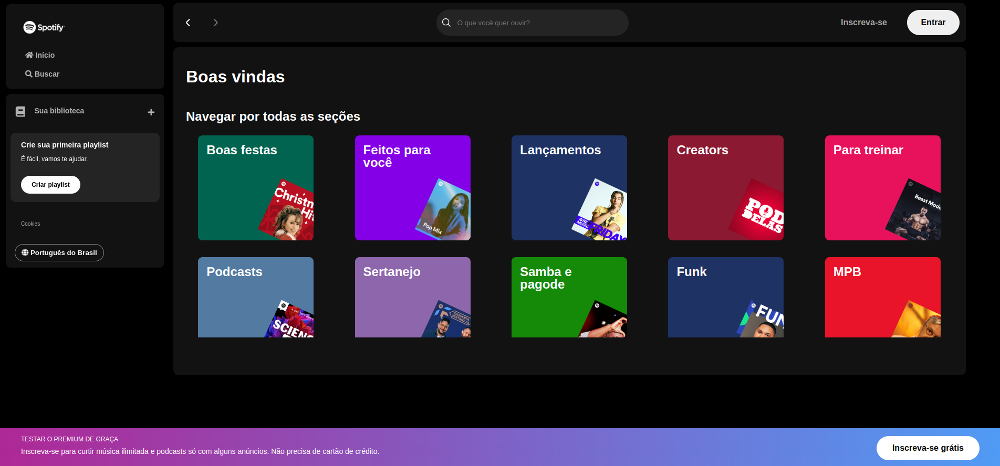

# Imersão Front End da Alura

Este repositório contém os códigos e arquivos desenvolvidos durante a **Imersão Front End** da [Alura](https://www.alura.com.br/). O objetivo do projeto é recriar uma versão do site do Spotify utilizando **HTML**, **CSS**, **JavaScript** e **React**, aplicando os conhecimentos adquiridos ao longo da imersão.

## 📚 Objetivos do Projeto  
- Reproduzir o layout do Spotify com fidelidade.  
- Aprender e praticar conceitos de **HTML semântico**, estilização com **CSS**, interatividade com **JavaScript** e **React**.  
- Explorar boas práticas de desenvolvimento front-end.  

## 🚀 Tecnologias Utilizadas  

 
 
 
 
 
 
 

## 🛠️ Funcionalidades do Projeto  
- Estrutura básica do site (navegação, listas de reprodução, player de música).  
- Estilização responsiva para diferentes dispositivos.  
- Interatividade com botões e elementos da interface.  
- Implementação da versão em React, aproveitando componentes reutilizáveis e hooks.  

## 🎯 Aprendizados  
Durante este projeto, coloquei em prática:  
- Uso de flexbox e grid layout para organizar o design.  
- Trabalhar com variáveis e seletores em CSS.  
- Manipulação do DOM com JavaScript para adicionar funcionalidades dinâmicas.  
- Criação de componentes em React e gerenciamento de estado.

## 🖼️ Prévia do Projeto  
